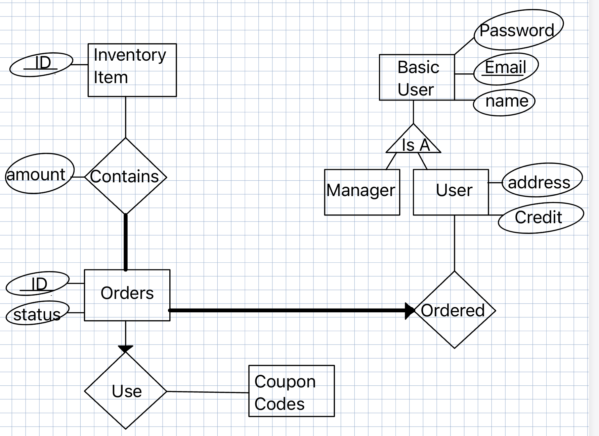

# Online Furniture Store

## Group Members
- Raz Ifrach
- Hili Atia
- Ron Gutin
- Amit Uzan

## Project Overview
This project simulates an online furniture store, providing a full e-commerce experience:
#### Manager:
- Inventory Management
- User Management
- Order Tracking 

#### User:
- Own Shopping Cart Management + Checkout system
- Credit Collection & Coupon Code Usage
- Profile Management


Our goal was to demonstrate a complete web-like application architecture, including database interactions, user flows, and business logic.

---

## Setup Instructions

### Prerequisites
- **MySQL Server** – Make sure you have a running MySQL instance.

### 1. Clone or Download the Repository
```
git clone https://github.com/RAZ-1012/Final_project.git
```

### 2. Create the Database
Find `init-db.sql` file in our repository and run it in your MySQL environment to create the initial DataBase. 

In `app/data/DbConnection.py`, update the following variables to match your MySQL setup:
```python
DATABASE_USERNAME = "your_username" 
DATABASE_PASSWORD = "your_password"
DATABASE_HOST = "localhost"
DATABASE_PORT = "3306"
DATABASE_NAME = "FinalProjectDB"
```



### 3. Install Dependencies
Make sure that you install all requirements of the project.
```bash
pip install -r requirements.txt
```


### 4. Run the Application
Finally, launch the application:
```bash
python main.py
```
Make sure that the application opens on `http://127.0.0.1:5005` for all endpoints to be active.

---

## API Documentation
- For convenience, we’ve included a file (“API Guide”) to explain the purpose and usage of all different API calls.
- If you are using PostMan we've included a file called `Furniture_Store_API_postman_collection.json` that you can import to the PostMan app.
- Below is a **sample** endpoint:

#### Add Item to Cart
- **Endpoint**: `PUT /add_item_to_cart`
- **Request Body**:
  ```json
  {
    "email": "ron@example.com",
    "amount": 2,
    "object_type": "dining_table",
    "item": { "color": "brown" }
  }
  ```
- **Response**:
  ```json
  {
    "message": "Item added to cart."
  }
  ```

For more endpoints and detailed request/response documentation, please refer to the **API Guide**.

---

## Tests
- Achieved 81% coverage of unittests.
- Added multiple Integration and Regression tests.
- Used GitHub workflows to run the tests automatically upon every push to main and a PR.
- To run integration and regression tests make sure your MySQL is launched
- All tests are located in /tests directory
- To run tests use `pytest path_to/tests`


## Contact / Contributing
If you have questions, feel free to open an issue or reach out to any of the group members.  
We welcome contributions! Fork the repo, create a feature branch, and submit a Pull Request.

---

*© 2025 – All rights reserved*


